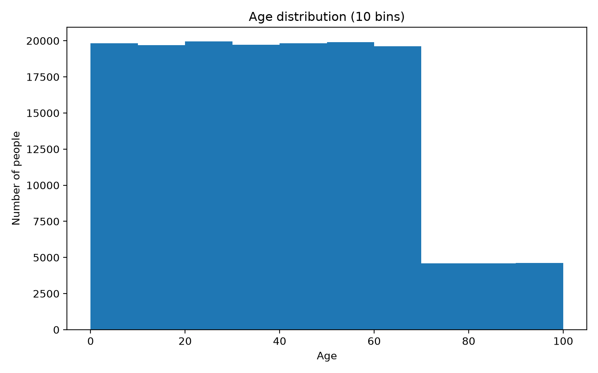
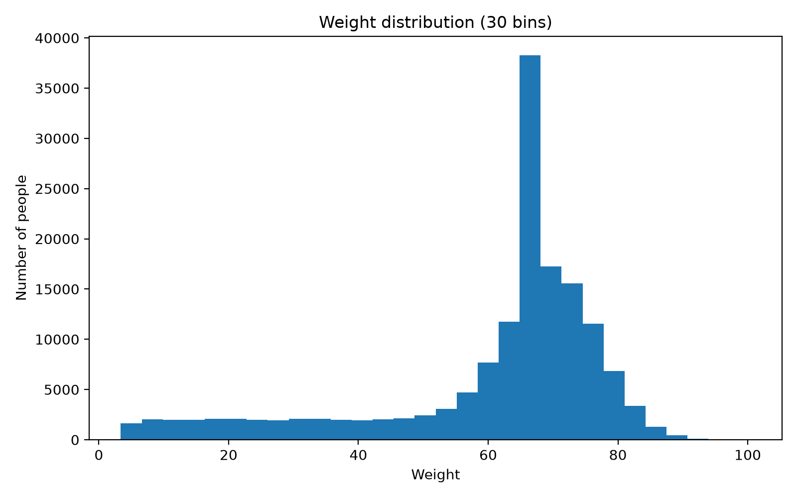
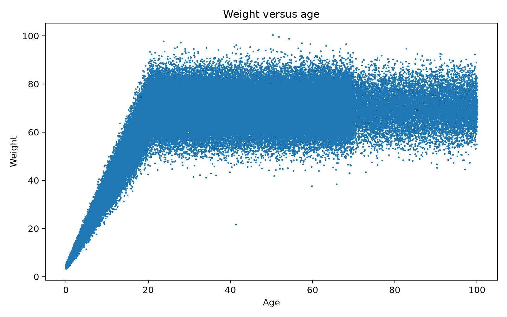

# Standards and Population Data

This project analyzes a JSON population dataset containing demographic fields and recent measurements for 152,361 individuals. The analysis examines age and weight distributions and investigates unusual observations.

## Contents

- `code.py` — descriptive statistics, histograms, a weight-versus-age scatter plot, and outlier lookup.
- `population.json` — source population records.
- `age_distribution.png` — age histogram using 10 bins.
- `weight_distribution.png` — weight histogram using 30 bins.
- `weight_vs_age.png` — scatter plot used to inspect age-weight relationships.

Run `python3 code.py` from this directory. The script resolves paths relative to its own directory and saves all three figures listed above.

## Development from studio work

The initial exploration loaded the JSON data and inspected individual variables. The final version calculates descriptive statistics, compares alternative bin counts, saves the selected age and weight histograms, adds an age-weight scatter plot, and filters the data to identify the unusual adult record.

## Findings

The dataset contains 152,361 records. Each record has an `id`, `name`, `demographics` (`age`, `household_income_band`, `eyecolor`), and `last_measurements` (`weight`, `temperature`).

Age has a mean of 39.51, standard deviation of 24.15, minimum of 0.0007, and maximum of 99.99. Ten bins were selected because they show the sharp decrease around age 70 while remaining readable. Weight has a mean of 60.88, standard deviation of 18.41, minimum of 3.38, and maximum of 100.44. Thirty bins show the sharp peak near 68; 22,613 records have a weight of exactly 68.0.

The age-versus-weight analysis identified one unusual adult observation: Anthony Freeman (ID 1002902), age 41.3 and weight 21.7. The record merits validation, but the plot alone cannot establish whether it is erroneous.

