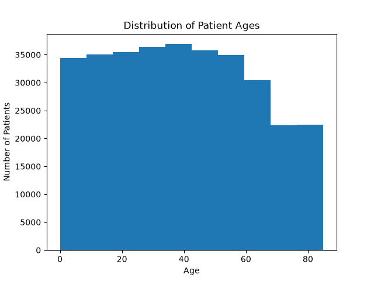
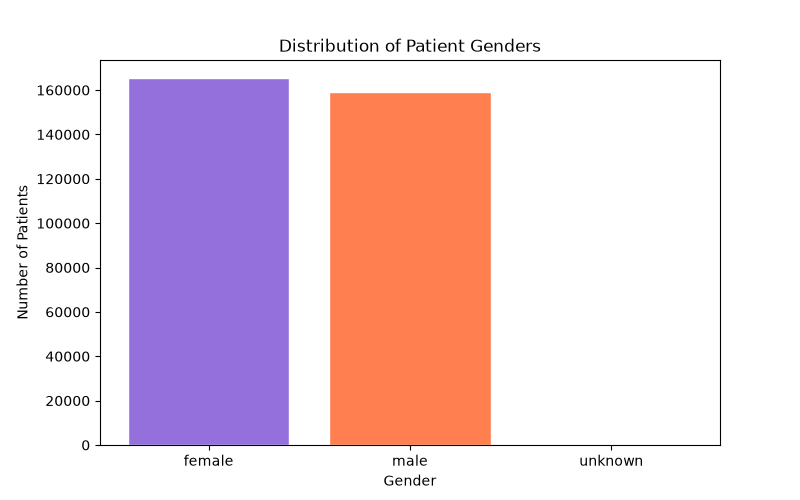

# Patient Data and Data Structures

This project analyzes an XML patient dataset using sorting, binary search, and prefix sums. The code reads the dataset, produces age and gender visualizations, and supports efficient age-based queries.

## Contents

- `code.py` — XML parsing, visualizations, sorting, binary search, and range-query implementation.
- `patients.xml` — patient records with name, age, and gender attributes.
- `age_histogram.png` — distribution of patient ages.
- `gender_bar.png` — distribution of patient genders.

Run `python3 code.py` from this directory. The script resolves `patients.xml` and its image outputs relative to the script location, so it also works when launched from another working directory.

## Development from studio work

The initial studio work focused on parsing the XML file and inspecting ages. The final version adds saved demographic figures, a sorted age index, a single-pass second-oldest search, left-bound binary search for exact and in-between targets, range-count queries, and a male prefix sum for efficient multi-criteria queries.

## Analysis

### Histogram of patient ages

Histograms with 5, 10, and 20 bins were explored. Ten bins were selected because they show the age distribution without making the figure overly fragmented.

### Gender distribution

Gender is stored as an attribute on each `<patient>` record rather than as a nested element. A bar chart was used because gender is categorical data.

The dataset contains three gender categories: `female`, `male`, and `unknown`.

### Sorting and top-k retrieval

`get_age()` extracts and converts the XML `age` attribute to a float, which enables numeric sorting from youngest to oldest. For a one-time second-oldest query, an O(n) single-pass approach avoids sorting. For repeated ordered queries, one O(n log n) sort enables O(1) position lookups.

The code identifies Monica Caponera (age 84.99855742449432) as the oldest patient and Raymond Leigh (age 84.9982928781625) as the second-oldest patient.

### Binary search and range queries

The left-bound binary search finds the first position where age 41.5 can be inserted while preserving order. It therefore returns the first exact match, if present, or a consistent insertion point otherwise. The number of patients aged 41.5 or older is computed as `len(age_index) - target_index` after the O(log n) lookup.

### Duplicate-age check

The 324,357 patient records contain no exact duplicate floating-point age values: every age occurs once. The left-bound binary-search design nevertheless handles duplicates correctly by returning the first matching position if a future dataset contains equal ages; for a target between values, it returns the consistent insertion point.

For `[low_age, high_age)` queries, two binary searches locate the range bounds and their index difference gives the count. A male-patient prefix sum is constructed once in O(n); each age-and-gender query then uses two O(log n) searches and O(1) prefix-sum subtraction.
