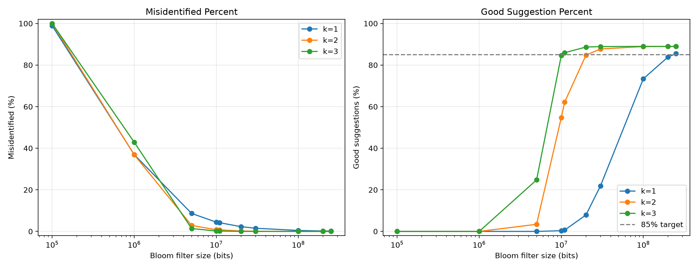

# Big Data and Bloom Filters

This project builds a Bloom filter from a word list and uses it to generate one-character substitution suggestions for misspelled words. It compares filters using one, two, and three hash functions, evaluates false-positive behavior with the supplied typo pairs, and visualizes the experiment results.

## Contents

- `code.py` — Bloom filter implementation and evaluation workflow.
- `plot_result.py` — plotting helper for the evaluation results.
- `words.txt` — source vocabulary.
- `typos.json` — typo/correct-word pairs used for evaluation.
- `bloom_filter_results.png` — experiment figure.

Run the code from this directory so its relative paths to `words.txt` and `typos.json` resolve correctly.

## Development from studio work

The project began with a Bloom filter and one-character substitution lookup. It was extended to compare one, two, and three hash functions across multiple filter sizes, evaluate the supplied typo pairs with two explicit metrics, and preserve the experiment results in a reproducible log-scale figure.

## Discussion

Bloom-filter membership responses can leak information about a vocabulary: a user can submit likely candidates and observe which ones pass. Increasing the number of hash functions reduced some false positives in this experiment, although it increases computation. Cryptographic hashes also do not prevent this membership-query leakage; they only provide hash values for setting and checking bits.

For the `floeer` test, the correction function tries every one-character substitution and keeps candidates accepted by the filter. With one hash function, false positives such as `bloeer` can appear; requiring two or three independent hash checks removes many pseudo-matches while retaining valid words such as `flower` and `floter`.

## Evaluation measures

- **Misidentified Percent** is the fraction of misspelled inputs in `typos.json` that the filter incorrectly reports as valid vocabulary. It is calculated only on the typo subset.
- **Good Suggestion Percent** is the fraction of all evaluation cases where the candidate list contains at most three suggestions and includes the known correct word.

`code.py` calculates these measures for each filter size and hash count. `plot_result.py` renders the saved, log-scale comparison figure from the recorded experiment values.

The Good Suggestion Rate exceeded 85% at approximately 250 million bits with one hash function, between 20 and 30 million bits with two hash functions, and 11 million bits with three hash functions. Allowing more edits expands the candidate space and can increase false positives.
