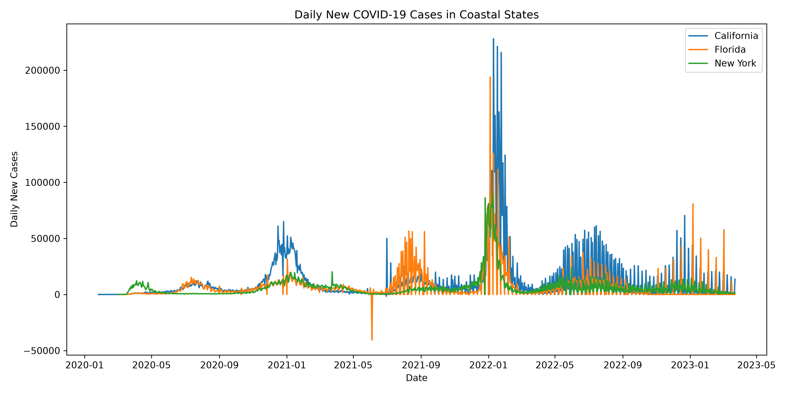

# COVID-19 State-Level Data

Emily Zhang
NetID: zz598

This project analyzes reported daily COVID-19 cases in California, Florida, and New York from a state-level cumulative case and death time series.

## Contents

- `covid_analysis.py` — calculates daily cases from cumulative totals, identifies peak dates, compares peak timing, checks Florida for negative daily counts, and saves the figure.
- `data/us-states.csv` — daily cumulative cases and deaths by U.S. state, with date, state, FIPS, cases, and deaths columns.
- `figures/daily_cases_comparison.png` — daily-case comparison for the three coastal states.

Run `python3 covid_analysis.py` from this directory with `pandas` and `matplotlib` installed. The script resolves its data file relative to the script location and writes `figures/daily_cases_comparison.png`.

## Findings

California's highest reported daily case count occurred on January 10, 2022. New York reached its daily-case peak before California. Florida includes a negative daily difference of -40,527 cases on June 4, 2021, which is best interpreted as a retrospective revision to a cumulative total rather than a real negative number of new cases.

Reported daily counts can be affected by reporting delays and backlogs. The dataset does not provide contextual factors such as testing availability, exposure risk, or public-health policies, so the visualization cannot by itself explain why trends changed.

