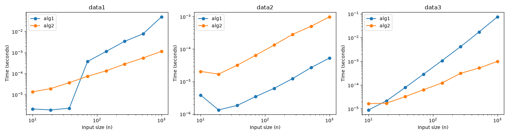

### 2a.

I tested `alg1` and `alg2` with four small lists:
| Input | `alg1` output | `alg2` output |
| -- | -- | -- |
| `[1, 2, 3]` | `[1, 2, 3]` | `[1, 2, 3]` |
| `[3, 2, 1]` | `[1, 2, 3]` | `[1, 2, 3]` |
| `[2, 1, 2]` | `[1, 2, 2]` | `[1, 2, 2]` |
| `[7, -1, 2]` | `[-1, 2, 7]` | `[-1, 2, 7]` |
Both functions sort the input in ascending order. The tests let them handle an sorted list, a reversed list, duplicate values, and a negative value.

`alg1` looks at two neighboring numbers at a time and swaps them if they are in the wrong order. It goes through the list again until it can make a full pass without swapping anything. `alg2` splits the list into smaller lists. It sorts those lists, then joins them together in order.

### 2b.
I measured how long `alg1` and `alg2` took to sort lists of different sizes, from about 10 to 1000 values. I tested both functions with three kinds of input: `data1` produces a more complex sequence, `data2` is already sorted, and `data3` is in reverse order. I generated each list before starting the timer, so the measured time includes only the sorting function.

The results depend on the order of the input. With the already sorted `data2`, `alg1` is faster because it makes one pass, finds no values to swap, and stops. With the reversed `data3`, `alg1` becomes much slower as the list grows because it must make many passes and swaps. It also becomes much slower on the larger `data1` inputs. The time for `alg2` grows more steadily across all three kinds of input.

Both axes in the figure use a logarithmic scale. On this kind of plot, a steeper line means that the running time grows faster as the list gets longer. For example, a slope near 1 suggests that multiplying the input size by 10 would multiply the time by about 10. A slope near 2 suggests that the time would multiply by about 100. The small inputs are very fast to process, so their measured times may vary between runs.
